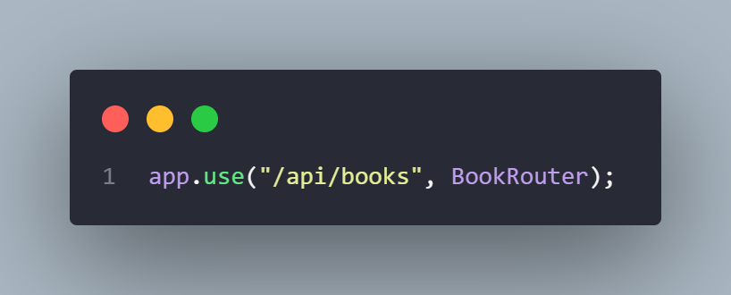

# Skill Test - Backend Developer Knitto

## Soal dan Jawaban

### 1. Implementasi Route pada Express.js

#### Book Endpoint

#### Book Route

#### Book Controller

#### Book Service

### 2. Middleware untuk Mengecek Token JWT

#### Middleware untuk mengecek token JWT pada header request

#### Mengamankan endpoint menggunakan middleware pada Express

### 3. Fungsi Asinkron dengan async/await menggunakan Node.js axios

### 4. Implementasi Fitur Pengunggahan File

#### Endpoint dan route untuk file upload

#### Controller file upload

#### Service file upload

### 5. Query SQL dengan Join

#### Join tabel books dan categories

### 6. Implementasi Transaksi di MySQL

#### Fungsi untuk update buku

### 7. Operasi CRUD

#### Create book

#### Read book

#### Update book

#### Delete book

### 8. API Endpoint untuk Operasi CRUD

#### Create Endpoint

#### Read Endpoint

#### Update Endpoint

#### Delete Endpoint

### 9. Penanganan Kesalahan di API Endpoint

#### Validasi input menggunakan library Zod

#### Membuat schema validasi

#### Meletakkan validasi di layer service

#### Membuat custom error untuk error yang bisa di-handle

#### Menggunakan try-catch di layer controller dan menjalankan fungsi next Express jika terjadi error

#### Error akan di-handle menggunakan middleware

#### Middleware untuk memfilter semua error

